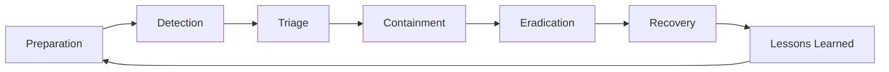

# Incident Response Lifecycle Workflow

This document describes the incident response (IR) lifecycle used in this repository and maps available playbooks, automation, templates, and workflows to each phase.

The lifecycle follows the NIST SP 800-61r2-aligned structure used by this project:

1. Preparation
2. Detection
3. Triage
4. Containment
5. Eradication
6. Recovery
7. Lessons Learned

---

## Workflow Diagram

The loop from **Lessons Learned** back to **Preparation** highlights continuous improvement.

---

## Phase Mapping

## 1) Preparation

**Goal:** Build readiness before incidents occur.

**Repository mapping:**
- `training/` — analyst onboarding and practical labs
- `templates/` — standardized records, timelines, reports, and communications
- `schemas/` — consistent incident data structures
- `workflows/` — incident state-machine foundations
- `cli/` and `ir_playbooks_automation_cli.py` — repeatable incident handling entrypoints

**Typical outputs:**
- Ready-to-use playbooks and templates
- Defined severity and response workflows
- Validated tooling access and automation permissions

---

## 2) Detection

**Goal:** Recognize potential suspicious activity from alerts, telemetry, and reports.

**Repository mapping:**
- `playbooks/triage/` — initial alert validation guidance
- `playbooks/incident-types/` — context-specific investigative starting points
- `cli/` — open incidents and capture first-seen details

**Typical outputs:**
- Candidate incident record
- Initial detection timestamp and source tracking

---

## 3) Triage

**Goal:** Determine incident validity, scope, impact, and priority.

**Repository mapping:**
- `playbooks/triage/` — classification, severity estimation, and escalation guidance
- `schemas/` — machine-readable incident status and metadata
- `workflows/` — state transitions from newly opened to actively handled
- `cli/` — severity updates and procedural execution support

**Typical outputs:**
- Confirmed incident declaration
- Severity assignment and owner/queue routing
- Early scope hypothesis

---

## 4) Containment

**Goal:** Limit attacker movement and reduce ongoing business impact.

**Repository mapping:**
- `playbooks/containment/` — containment procedures for common scenarios
- `automations/cloud/` — cloud isolation and exposure reduction actions
  - EC2 isolation
  - Azure VM network isolation
  - GCP instance isolation
  - S3 public-access lockdown
- `automations/identity/` — session and credential containment actions
- `playbooks/incident-types/` — incident-specific containment decisions

**Typical outputs:**
- Isolated hosts/accounts/resources
- Reduced blast radius
- Logged and auditable containment actions

---

## 5) Eradication

**Goal:** Remove adversary access, persistence, and malicious artifacts.

**Repository mapping:**
- `playbooks/eradication/` — cleanup and persistence-removal procedures
- `automations/evidence_packaging/` — evidence preservation before/while cleanup
- `templates/timelines/` — sequence reconstruction to validate full removal

**Typical outputs:**
- Persistence mechanisms removed
- Compromised access paths disabled
- Evidence retained with integrity checks

---

## 6) Recovery

**Goal:** Restore systems to normal operation with monitoring and safeguards.

**Repository mapping:**
- `playbooks/recovery/` — controlled restoration and validation steps
- `templates/incident-records/` — recovery checkpoints and approvals
- `workflows/` — transition to recovery/completed states

**Typical outputs:**
- Services restored safely
- Heightened monitoring period initiated
- Business function normalization

---

## 7) Lessons Learned

**Goal:** Improve capability, reduce recurrence, and capture organizational learning.

**Repository mapping:**
- `templates/reports/` — technical and executive reporting artifacts
- `templates/communications/` — stakeholder-ready summaries
- `templates/timelines/` — final event chronology
- `docs/` and `playbooks/` — updates based on findings
- `ROADMAP.md` — capability gaps promoted into planned improvements

**Typical outputs:**
- Post-incident report
- Root-cause and control-gap analysis
- Action items for detections, playbooks, and automation enhancements

---

## Practical Usage Notes

- Use the lifecycle as the default progression, but apply iteration when new evidence appears.
- Evidence handling should occur throughout all phases, not only during eradication.
- Automation should be used for repeatable, low-risk actions with auditability, while analysts retain decision control for high-impact steps.

This document is intended as the top-level workflow reference; detailed step-by-step instructions remain in the phase-specific playbooks and automation modules.